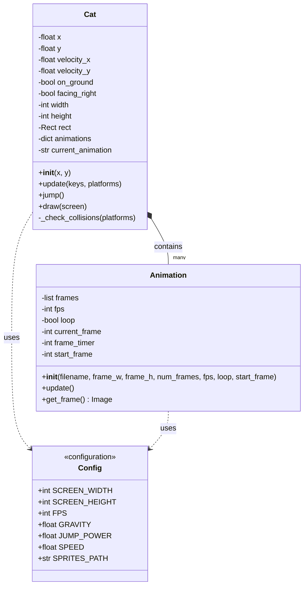

## 🏗️ Архитектура проекта Cat Dreams

### Диаграмма классов

```mermaid
classDiagram
    class Cat {
        -float x
        -float y
        -float velocity_x
        -float velocity_y
        -bool on_ground
        -bool facing_right
        -int width
        -int height
        -Rect rect
        -dict animations
        -str current_animation
        +__init__(x, y)
        +update(keys, platforms)
        +jump()
        +draw(screen)
        -_check_collisions(platforms)
    }

    class Animation {
        -list frames
        -int fps
        -bool loop
        -int current_frame
        -int frame_timer
        -int start_frame
        +__init__(filename, frame_w, frame_h, num_frames, fps, loop, start_frame)
        +update()
        +get_frame() Image
    }

    class Config {
        <<configuration>>
        +int SCREEN_WIDTH
        +int SCREEN_HEIGHT
        +int FPS
        +float GRAVITY
        +float JUMP_POWER
        +float SPEED
        +str SPRITES_PATH
    }

    Cat "1" *-- "many" Animation : contains
    Cat ..> Config : uses
    Animation ..> Config : uses
```